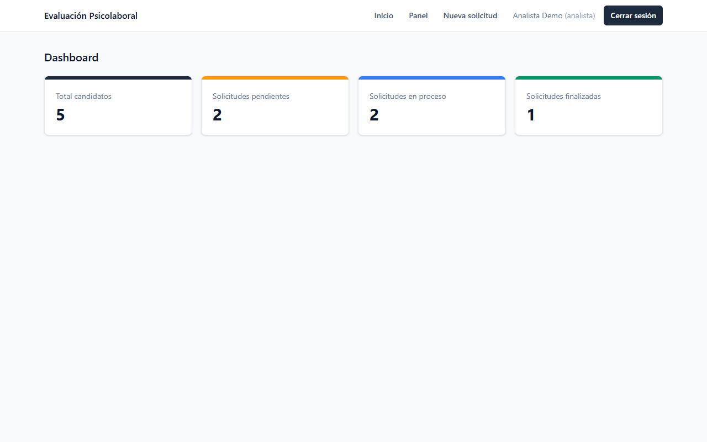
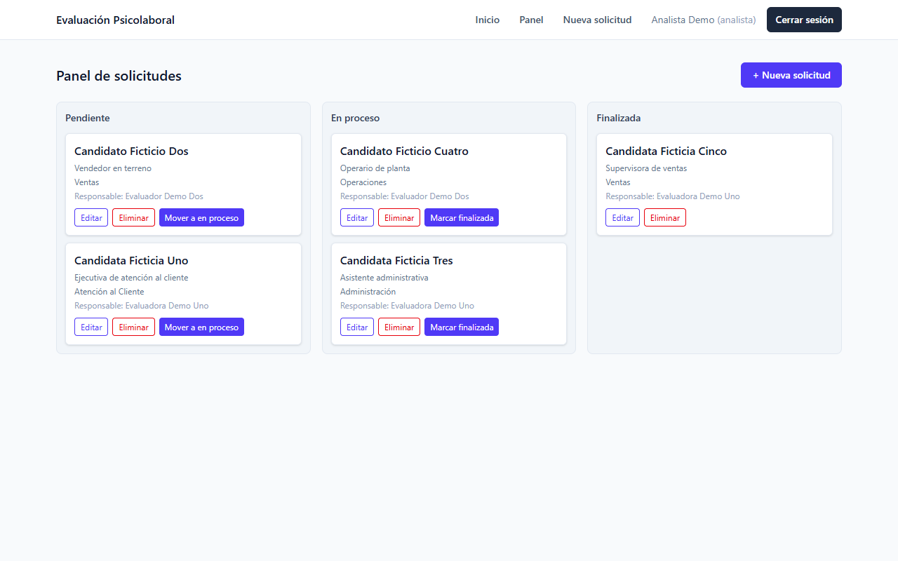
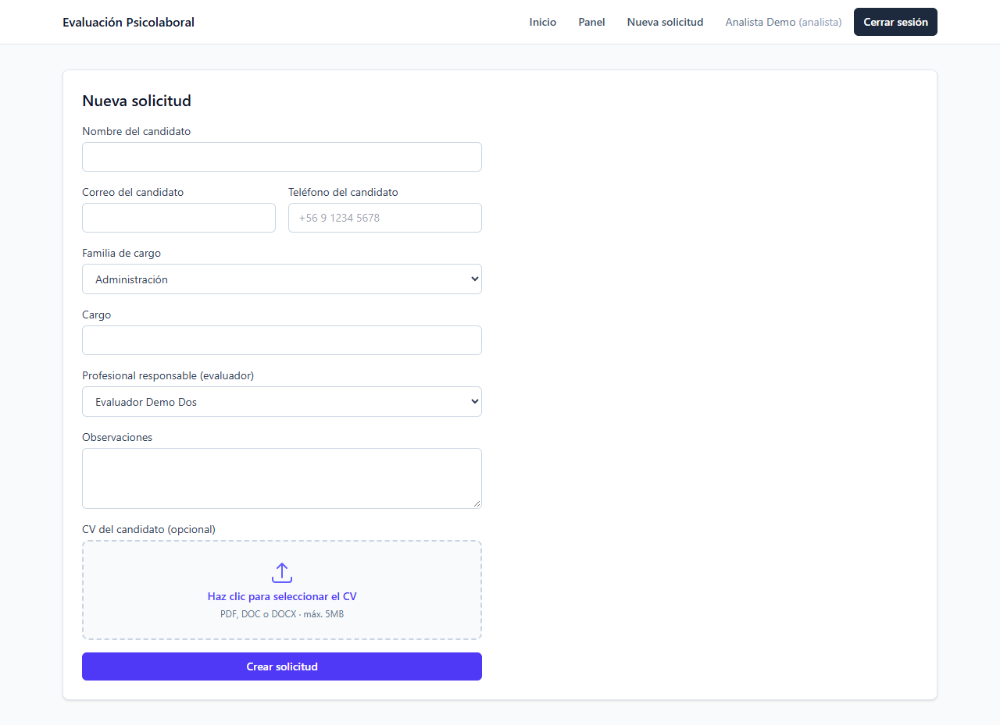
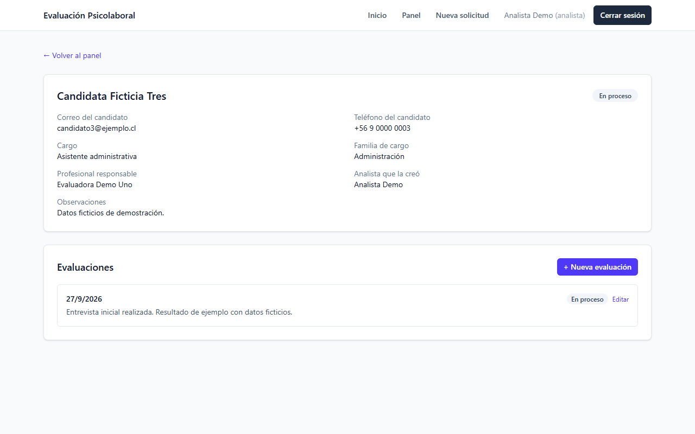
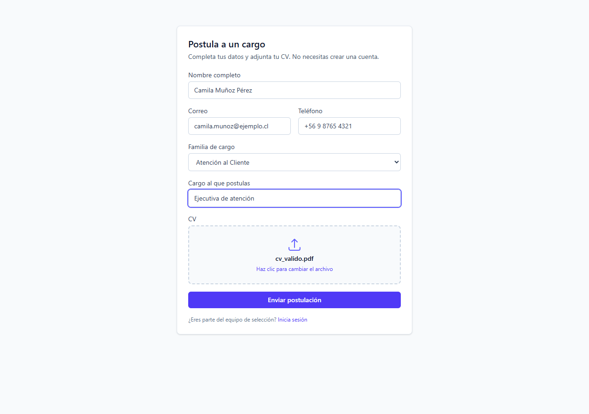

# Evaluación Psicolaboral — Digitalización del proceso de Reclutamiento y Selección

**Autor:** Cristobal González, estudiante de Duoc UC Puerto Montt.

Aplicación web (MVP) que digitaliza el proceso de **evaluación psicolaboral**
dentro de un flujo de Reclutamiento y Selección. Permite registrar solicitudes
de evaluación para candidatos, asignarles un profesional responsable, seguir su
avance en un tablero Kanban, registrar las evaluaciones asociadas y consultar
indicadores en un dashboard.

Cuando un proceso así se gestiona de forma manual y con la información
repartida en distintos lugares, cuesta saber en qué estado está cada
candidato. Este MVP propone centralizar esa información en un solo lugar.

## Capturas de pantalla

Tomadas con la aplicación corriendo en local y **datos ficticios** de
demostración.

**Dashboard de indicadores**



**Panel Kanban de solicitudes**



**Formulario de nueva solicitud**



**Detalle de solicitud con sus evaluaciones**



**Formulario público de postulación (sin login)**



## Contexto académico

- **Asignatura:** Full Stack II — DSY1104
- **Institución:** Duoc UC
- **Tipo de proyecto:** Vinculación con el Medio, en colaboración con **AquaChile**
- **Alcance evaluado:** Caso de la asignatura DSY1104

> ### ⚠️ Aviso sobre los datos
>
> **Todos los datos de esta aplicación son ficticios y fueron creados
> únicamente con fines académicos y de demostración.**
>
> Los candidatos, usuarios, correos, teléfonos, cargos, evaluaciones y archivos
> que aparecen en el sistema **no corresponden a información real de AquaChile,
> ni a personas reales, ni a procesos de selección reales** de la empresa. No se
> utilizó ningún dato personal ni información confidencial de la organización.

## Despliegue

| Parte | URL |
| ----- | --- |
| Frontend (Vercel) | https://evaluacion-fullstack-psicolaboral.vercel.app |
| Backend / API (Render) | https://evaluacion-fullstack-psicolaboral.onrender.com |

> **Nota importante sobre la primera carga.** El backend está en el plan
> gratuito de Render, que **suspende el servicio tras un período de
> inactividad**. Si nadie lo ha usado en un rato, la primera petición debe
> "despertarlo" y puede tardar **hasta ~50 segundos**. Si al entrar la pantalla
> de inicio de sesión parece colgada, espera ese tiempo y reintenta: es el
> arranque en frío, no un error de la aplicación. Las peticiones siguientes
> responden con normalidad.
>
> Para adelantar el arranque puedes abrir primero
> `https://evaluacion-fullstack-psicolaboral.onrender.com/api/health`,
> que responde `{"estado":"ok"}` cuando el backend ya está despierto.

## Estado del avance

Situación al 5 de octubre de 2026, organizada por hitos de entrega.

| Hito | Estado |
| ---- | ------ |
| Hito 1 — Frontend funcional | ✅ Completo |
| Hito 2 — Integración Full Stack | 🟡 En curso (permisos por rol aplicados; faltan pruebas automatizadas) |
| Hito 3 — MVP final desplegado | 🟡 En curso (hay una versión desplegada, aún no es la final) |

### Hito 1 — Frontend funcional

**Completo:**

- Vistas de inicio de sesión, registro, dashboard, panel Kanban, nueva
  solicitud, edición y detalle de solicitud, construidas con React, Vite y
  Tailwind.
- Rutas protegidas y navegación con React Router.
- Validaciones de formulario (correo y celular chileno) y mensajes de error.
- Formulario público de postulación (`/postular`), sin login.
- La interfaz se adapta al rol: cada usuario solo ve los botones de las
  acciones que puede hacer.
- Corregido: la fecha de cada evaluación ya no se muestra un día antes. Se
  trata como día de calendario (sin zona horaria) al guardarla y al mostrarla.

### Hito 2 — Integración Full Stack

**Completo:**

- El frontend consume la API REST real (Express 5 + MongoDB Atlas) en todas
  sus vistas; no hay datos simulados en la interfaz.
- Autenticación con JWT de punta a punta, incluido el manejo de sesión
  expirada.
- CRUD de solicitudes, cambio de estado, evaluaciones, dashboard calculado en
  el backend, carga de CV y creación automática de la carpeta del candidato
  con sus plantillas.
- **Permisos por rol aplicados en el servidor** con `permitirRoles` y, para
  las evaluaciones y el informe, con una verificación de que el evaluador sea
  el responsable de la solicitud (ver *Autenticación y roles*).
- **Registro restringido:** solo crea analistas y evaluadores; el servidor
  rechaza `admin` o cualquier otro rol aunque se envíe a mano.
- Informe de entrevista (Word) adjunto al candidato, además del CV.
- Regla del Kanban: una solicitud sin evaluador no puede pasar a "En proceso"
  ni a "Finalizada".
- **Archivos en MongoDB:** los CV y los informes se guardan en la base de
  datos (modelo `Archivo`) y solo se descargan con sesión iniciada.

**Pendiente:**

- **Crear administradores.** Como el registro ya no permite `admin`, un
  administrador nuevo se crea directamente en la base de datos.
- **Pruebas automatizadas del backend.** El frontend ya tiene pruebas
  unitarias con Jasmine y Karma (ver *Pruebas*); el backend se ha verificado
  con pruebas manuales y scripts de API que no forman parte del repositorio.
- Los modelos `Entrevista` e `Informe` siguen sin exponerse en la API (ver
  la nota de alcance en *Modelo de datos*).

### Hito 3 — MVP final desplegado

**Completo:**

- Frontend desplegado en Vercel y backend en Render, conectados a MongoDB
  Atlas (URLs en la sección *Despliegue*).
- Etiqueta `v1.0-mvp` (17 de septiembre de 2026) que congela la versión
  desplegada actual.

**Pendiente:**

- Desplegar la versión final una vez cerrados los pendientes del Hito 2.
- El backend usa el plan gratuito de Render: la primera carga tras un rato
  sin uso puede tardar hasta ~50 segundos.
- Los CV e informes subidos **antes** del cambio a MongoDB se guardaban en el
  disco efímero de Render y ya se perdieron; en el detalle aparecen como
  "Archivo no disponible" y hay que volver a subirlos.

> La integración con IA se trabaja aparte, en la rama
> `feature/integracion-ia`. Es experimental, no forma parte del alcance
> evaluado y no está incluida en `main`.

## Stack tecnológico

**Frontend**

- React 19 con **Vite** como bundler y servidor de desarrollo
- **Tailwind CSS v4** (integrado con el plugin `@tailwindcss/vite`)
- React Router para la navegación entre vistas
- Axios como cliente HTTP, con interceptores para el token y el manejo de sesión
- **Jasmine + Karma** (ChromeHeadless) para las pruebas unitarias, con cobertura de
  `karma-coverage`

**Backend**

- Node.js con **Express 5** (API REST, ES Modules)
- **MongoDB Atlas** como base de datos, con **Mongoose** como ODM
- **JWT** (`jsonwebtoken`) para autenticación, y `bcryptjs` para el hasheo de contraseñas
- `multer` (en memoria) para recibir los archivos, que se guardan en MongoDB
- `express-rate-limit` para limitar las postulaciones públicas por IP
- `exceljs` y `docx` para generar las plantillas de informe y pauta de entrevista

## Funcionalidades implementadas

### Autenticación y roles

- Registro e inicio de sesión con JWT; la contraseña se guarda hasheada con bcrypt.
- Tres roles: **`analista`**, **`evaluador`** y **`admin`**.
- El registro público solo permite elegir **analista** o **evaluador**; el
  servidor rechaza cualquier otro valor (incluido `admin`).
- Todas las rutas de negocio exigen token válido.
- **Permisos por rol**, aplicados en el servidor (la interfaz además oculta lo
  que el rol no puede hacer):

  | Acción | Analista | Evaluador | Admin |
  | ------ | :------: | :-------: | :---: |
  | Ver dashboard, Kanban y detalle de solicitudes | ✅ | ✅ | ✅ |
  | Crear y editar solicitudes y candidatos, asignar evaluador, mover de estado | ✅ | — | ✅ |
  | Crear y editar evaluaciones | — | Solo si es el responsable | ✅ |
  | Subir el informe de entrevista | ✅ | Solo si es el responsable | ✅ |
  | Eliminar solicitudes | — | — | ✅ |

- Las solicitudes que llegan por `/postular` (sin analista) las ven todos los
  analistas.
- Rutas protegidas en el frontend: sin sesión, se redirige a inicio de sesión.
- **Manejo de sesión expirada:** si la API responde `401`, la aplicación limpia
  la sesión, redirige al login y avisa "Tu sesión expiró, vuelve a iniciar sesión".

### Gestión de solicitudes (CRUD completo)

- Crear, listar, ver el detalle, editar y eliminar solicitudes de evaluación.
- Cada solicitud registra: candidato, familia de cargo, cargo, observaciones,
  profesional responsable (un usuario con rol `evaluador`) y el analista que la creó.
- Al eliminar una solicitud se borran también su CV y su carpeta de candidato,
  para no dejar archivos huérfanos.

### Postulación pública (sin login)

Además de la vía privada del analista, un candidato **interno o externo** puede
postular por su cuenta, sin crear una cuenta. Ambas vías escriben en la misma
base de datos.

1. El candidato entra a **`/postular`** (también enlazado desde el login con
   "¿Quieres postular a un cargo? Postula aquí"). La página no muestra la barra
   de navegación privada.
2. Ingresa nombre completo, correo, teléfono (celular chileno), familia de
   cargo, cargo al que postula y su **CV obligatorio** (PDF, DOC o DOCX, máx. 5 MB).
3. Al enviar ve la confirmación **"Postulación recibida"**.
4. El backend crea el `Candidato` con `origen: "postulacion_publica"` y una
   `Solicitud` en estado **Pendiente sin evaluador asignado**, con su carpeta de
   candidato (CV + plantillas) igual que en el flujo privado.
5. La solicitud aparece en el **Kanban** del analista con la etiqueta
   **"Postulación pública"** y el aviso "Sin evaluador asignado". Desde la
   tarjeta ("Asignar evaluador") o desde el detalle, el analista le asigna un
   evaluador y la gestiona como cualquier otra.

Si ya existe un candidato con el mismo correo, la postulación se rechaza con un
mensaje claro (no se duplica ni se sobrescriben datos existentes).

**Seguridad del endpoint público:**

- **Rate limiting:** máximo 5 postulaciones aceptadas por hora e IP, y un tope
  de 20 intentos cada 15 minutos (incluidos los fallidos).
- **Validación estricta del CV en el servidor:** extensión, tipo MIME y firma
  real del archivo (los primeros bytes de un PDF, DOC o DOCX), y tamaño máximo
  de 5 MB. El archivo se valida en memoria y se guarda en MongoDB (ver
  *Archivos del candidato*).
- **Honeypot anti-bots:** un campo oculto que solo los bots completan; si
  viene lleno, la postulación se descarta en silencio.
- **Sanitización** del texto (sin etiquetas HTML ni caracteres de control, con
  largo máximo) y validación de correo y teléfono también en el servidor.
- El endpoint **ignora** cualquier campo de la parte privada (rol, estado,
  evaluador, analista) y sus respuestas no devuelven datos de otros candidatos
  ni de usuarios. El listado público de familias expone solo `_id` y `nombre`.

### Gestión de candidatos

- Los datos del candidato (nombre, correo y teléfono) se capturan desde el
  formulario de la solicitud o desde la postulación pública.
- **Validaciones** aplicadas en frontend y backend: formato de correo y formato
  de celular chileno (`+56 9` seguido de 8 dígitos, con espacios opcionales).

### Panel Kanban

- Tablero con tres columnas según el estado de la solicitud:
  **Pendiente → En proceso → Finalizada**.
- Cada tarjeta muestra candidato, cargo, familia de cargo y responsable, y
  permite avanzar de estado y editar sin recargar la página. El botón
  "Eliminar" solo lo ve un admin.
- **Regla de negocio:** una solicitud sin evaluador asignado no puede pasar a
  "En proceso" ni a "Finalizada". El servidor lo rechaza con un mensaje claro
  y, en la tarjeta, el botón de avance se reemplaza por "Asignar evaluador".
- Las solicitudes que llegan desde `/postular` llevan la etiqueta
  **"Postulación pública"** y, mientras no tengan evaluador, un botón
  **"Asignar evaluador"**.

### Evaluaciones

- Entidad propia asociada a cada solicitud, con fecha, resultado/observaciones
  y su propio estado.
- Se crean, listan y editan desde la vista de detalle de la solicitud.

### Dashboard de indicadores

- Tarjetas con el total de candidatos y el número de solicitudes pendientes,
  en proceso y finalizadas, calculadas en el backend.

### Informe de entrevista

- Además del CV, cada candidato puede tener adjunto el **informe de la
  entrevista** en Word (`.doc` o `.docx`, máx. 5 MB).
- Lo pueden subir o reemplazar el analista, el evaluador responsable de la
  solicitud o un admin. El servidor valida extensión, tipo y firma real del
  archivo.
- El detalle de la solicitud muestra la sección **Archivos del candidato**
  con el CV y el informe, cada uno con su botón de descarga.

### Carga de CV

- Archivo en formato PDF, DOC o DOCX, con un límite de **5 MB**: opcional en
  la vía del analista y obligatorio en la postulación pública.
- El backend rechaza cualquier otro formato o tamaño con un mensaje claro.

### Archivos del candidato (CV e informe) en MongoDB

- Los archivos **no se guardan en el disco del servidor**: el disco de Render
  es efímero y se borraba al reiniciarse o dormirse el servicio. Ahora cada
  archivo es un documento del modelo `Archivo` en MongoDB (con el contenido
  como `Buffer`), referenciado desde el candidato (`cvArchivoId` e
  `informeArchivoId`). Con el límite de 5 MB queda muy por debajo del máximo
  de 16 MB por documento, por lo que no hace falta GridFS.
- `multer` recibe el archivo en memoria; el servidor valida extensión, tipo
  MIME, firma real del contenido y tamaño antes de guardarlo.
- **Descarga solo con sesión:** `GET /api/archivos/:id` exige token
  (analista, evaluador o admin) y responde con el `Content-Type` y el nombre
  original del archivo. Ya no existe la carpeta pública `/uploads`. En el
  frontend, el botón "Descargar" pide el archivo con el token y dispara la
  descarga; no hay enlaces directos.
- Al eliminar una solicitud (solo admin) se borran también el candidato y sus
  archivos.
- Los datos anteriores al cambio que aún apuntan a una ruta en disco se
  muestran como **"Archivo no disponible"**, sin romper la pantalla.

### Automatización de carpetas y plantillas

Cada familia de cargo tiene su propia plantilla de informe (`.xlsx`) y pauta de
entrevista (`.docx`), generadas por script en `backend/plantillas/<familia>/`.

Como **comodidad local**, al crear una solicitud el sistema arma la carpeta
`backend/candidatos/<nombre-candidato>-<id-solicitud>/` y copia dentro:

1. Una copia del CV del candidato (si se adjuntó).
2. La plantilla de informe de su familia de cargo.
3. La pauta de entrevista de su familia de cargo.

Al subir el informe de entrevista, también se deja una copia
(`Informe_entrevista.docx`). El endpoint `GET /api/solicitudes/:id/carpeta`
permite consultar el contenido de esa carpeta.

La carpeta es opcional: los archivos reales viven en MongoDB. Si escribir en
disco falla (por ejemplo en Render), el error se registra en el log y la
solicitud, la postulación o el informe se guardan igual.

## Modelo de datos

### `Usuario`

| Campo | Tipo | Detalle |
| ----- | ---- | ------- |
| `nombre` | String | Obligatorio |
| `correo` | String | Obligatorio, único |
| `password` | String | Obligatorio, mínimo 6 caracteres, hasheado y oculto en las consultas |
| `rol` | String | `analista` \| `evaluador` \| `admin` (por defecto `analista`) |

### `Candidato`

| Campo | Tipo | Detalle |
| ----- | ---- | ------- |
| `nombre` | String | Obligatorio |
| `correo` | String | Obligatorio, validado como email |
| `telefono` | String | Obligatorio, validado como celular chileno |
| `cvArchivoId` | ObjectId → `Archivo` | CV del candidato, opcional |
| `informeArchivoId` | ObjectId → `Archivo` | Informe de entrevista (Word), opcional |
| `cvUrl`, `informeEntrevistaUrl` | String | Rutas antiguas en disco (datos previos a MongoDB); solo para mostrar "Archivo no disponible" |
| `origen` | String | `analista` \| `postulacion_publica` (por defecto `analista`) |

### `Archivo`

| Campo | Tipo | Detalle |
| ----- | ---- | ------- |
| `nombreOriginal` | String | Nombre con el que se subió; se usa al descargar |
| `mimeType` | String | Tipo del archivo (PDF o Word) |
| `tamano` | Number | Bytes, máximo 5 MB |
| `tipo` | String | `cv` \| `informe` |
| `datos` | Buffer | Contenido; no se incluye en las consultas normales |
| `candidatoId` | ObjectId → `Candidato` | Obligatorio |
| `subidoPor` | ObjectId → `Usuario` | Quién lo subió; vacío en las postulaciones públicas |
| `fecha` | Date | Por defecto, la fecha de carga |

### `FamiliaDeCargo`

| Campo | Tipo | Detalle |
| ----- | ---- | ------- |
| `nombre` | String | Obligatorio, único |
| `plantillaInforme` | String | Ruta relativa al `.xlsx` de la plantilla |
| `pautaEntrevista` | String | Ruta relativa al `.docx` de la pauta |

Familias precargadas: Atención al Cliente, Ventas, Administración y Operaciones.

### `Solicitud`

| Campo | Tipo | Detalle |
| ----- | ---- | ------- |
| `candidato` | ObjectId → `Candidato` | Obligatorio |
| `familiaDeCargo` | ObjectId → `FamiliaDeCargo` | Obligatorio |
| `cargo` | String | Obligatorio |
| `cvUrl` | String | Ruta antigua del CV en disco (datos previos a MongoDB) |
| `carpetaCandidato` | String | Nombre de la carpeta local generada (vacío si el disco no estaba disponible) |
| `observaciones` | String | Texto libre |
| `profesionalResponsable` | ObjectId → `Usuario` | Debe tener rol `evaluador`. Obligatorio al crear o editar por la vía privada; vacío en las postulaciones públicas hasta que el analista lo asigna |
| `analistaId` | ObjectId → `Usuario` | Quien creó la solicitud; vacío si la envió el propio candidato desde `/postular` |
| `estado` | String | `Pendiente` \| `En proceso` \| `Finalizada` |
| `fecha` | Date | Por defecto, la fecha de creación |

### `Evaluacion`

| Campo | Tipo | Detalle |
| ----- | ---- | ------- |
| `solicitud` | ObjectId → `Solicitud` | Obligatorio |
| `fechaEvaluacion` | Date | Por defecto, la fecha actual |
| `resultado` | String | Resultado u observaciones de la evaluación |
| `estado` | String | `Pendiente` \| `En proceso` \| `Finalizada` |

Todas las entidades incluyen además `createdAt` y `updatedAt` automáticos.

> **Nota de alcance:** el repositorio también contiene los modelos `Entrevista`
> e `Informe`, definidos en una etapa temprana del proyecto. Se mantienen en el
> código pero **no están expuestos por la API ni se usan en la interfaz**: su
> funcionalidad quedó fuera del alcance de este MVP.

## API REST

Base local: `http://localhost:4000` · Base en producción:
`https://evaluacion-fullstack-psicolaboral.onrender.com`

Salvo los endpoints marcados como públicos, **todos requieren** la cabecera:

```
Authorization: Bearer <token>
```

### Salud

| Método | Ruta | Descripción |
| ------ | ---- | ----------- |
| `GET` | `/api/health` | Chequeo de estado. Público. |

### Autenticación — `/api/auth`

| Método | Ruta | Descripción |
| ------ | ---- | ----------- |
| `POST` | `/api/auth/registro` | Crea un usuario (`nombre`, `correo`, `password`, `rol`). Devuelve usuario y token. Público. |
| `POST` | `/api/auth/login` | Inicia sesión (`correo`, `password`). Devuelve usuario y token. Público. |
| `GET` | `/api/auth/perfil` | Datos del usuario autenticado. |

### Usuarios — `/api/usuarios`

| Método | Ruta | Descripción |
| ------ | ---- | ----------- |
| `GET` | `/api/usuarios` | Lista usuarios. Acepta `?rol=evaluador` para filtrar (lo usa el selector de profesional responsable). Analista y admin. |

### Familias de cargo — `/api/familias`

| Método | Ruta | Descripción |
| ------ | ---- | ----------- |
| `GET` | `/api/familias` | Lista las familias de cargo disponibles. |

### Solicitudes — `/api/solicitudes`

| Método | Ruta | Descripción |
| ------ | ---- | ----------- |
| `GET` | `/api/solicitudes` | Lista todas las solicitudes, con candidato, familia, analista y responsable ya poblados. |
| `POST` | `/api/solicitudes` | Crea una solicitud. **`multipart/form-data`**. |
| `GET` | `/api/solicitudes/:id` | Detalle de una solicitud. |
| `PUT` | `/api/solicitudes/:id` | Edita la solicitud. **`multipart/form-data`**; si se adjunta un CV nuevo, reemplaza el anterior. |
| `DELETE` | `/api/solicitudes/:id` | Elimina la solicitud, sus evaluaciones, su CV, el informe y su carpeta de candidato. Solo admin. |
| `PATCH` | `/api/solicitudes/:id/estado` | Cambia el estado (`Pendiente`, `En proceso` o `Finalizada`). Rechaza "En proceso" y "Finalizada" si no hay evaluador asignado. |
| `GET` | `/api/solicitudes/:id/carpeta` | Lista los archivos de la carpeta del candidato. |
| `PUT` | `/api/solicitudes/:id/informe-entrevista` | Sube o reemplaza el informe de entrevista (`informe`, Word, máx. 5 MB). **`multipart/form-data`**. Analista, admin o evaluador responsable. |
| `GET` | `/api/solicitudes/:id/evaluaciones` | Lista las evaluaciones de esa solicitud. |
| `POST` | `/api/solicitudes/:id/evaluaciones` | Crea una evaluación asociada a esa solicitud (`fechaEvaluacion` en formato `AAAA-MM-DD`). Evaluador responsable o admin. |

Campos de `POST` y `PUT` de solicitudes: `candidatoNombre`, `candidatoCorreo`,
`candidatoTelefono`, `familiaDeCargo` (id), `cargo`, `profesionalResponsable`
(id de un usuario `evaluador`), `observaciones` (opcional) y `cv` (archivo,
opcional).

### Postulaciones públicas — `/api/postulaciones`

Sin token. Con rate limiting (ver *Postulación pública*).

| Método | Ruta | Descripción |
| ------ | ---- | ----------- |
| `GET` | `/api/postulaciones/familias` | Solo `_id` y `nombre` de las familias de cargo, para el selector del formulario. Público. |
| `POST` | `/api/postulaciones` | Registra una postulación. **`multipart/form-data`** con `nombre`, `correo`, `telefono`, `familiaDeCargo` (id), `cargo` y `cv` (obligatorio). Responde `201`, `400` (datos o archivo inválidos), `409` (correo ya registrado) o `429` (límite alcanzado). Público. |

### Evaluaciones — `/api/evaluaciones`

| Método | Ruta | Descripción |
| ------ | ---- | ----------- |
| `PUT` | `/api/evaluaciones/:id` | Edita una evaluación (`fechaEvaluacion`, `resultado`, `estado`). Evaluador responsable o admin. |

### Dashboard — `/api/dashboard`

| Método | Ruta | Descripción |
| ------ | ---- | ----------- |
| `GET` | `/api/dashboard` | Totales: candidatos y solicitudes pendientes, en proceso y finalizadas. |

### Archivos

| Método | Ruta | Descripción |
| ------ | ---- | ----------- |
| `GET` | `/api/archivos/:id` | Descarga un CV o informe guardado en MongoDB, con su `Content-Type` y nombre original. Requiere token (analista, evaluador o admin): sin token responde `401`. |

## Instalación y ejecución local

### Requisitos previos

- **Node.js 18 o superior** y npm
- Una base de datos MongoDB: una instancia local o una gratuita en **MongoDB Atlas**

> Si usas MongoDB Atlas, recuerda agregar tu IP en **Network Access**; de lo
> contrario la conexión será rechazada.

### 1. Clonar el repositorio

```bash
git clone https://github.com/CristobalAGV/evaluacion-fullstack-psicolaboral.git
cd evaluacion-fullstack-psicolaboral
```

### 2. Backend

```bash
cd backend
npm install
cp .env.example .env    # luego edita el .env con tus valores
npm run dev             # queda escuchando en http://localhost:4000
```

Variables de entorno (`backend/.env`):

| Variable | Para qué sirve |
| -------- | -------------- |
| `PORT` | Puerto donde escucha la API. Por defecto `4000`. En Render lo asigna la plataforma. |
| `MONGO_URI` | Cadena de conexión a MongoDB (local o Atlas), incluyendo el nombre de la base de datos. |
| `JWT_SECRET` | Texto secreto con el que se firman los tokens. Debe ser largo y distinto en producción. |
| `JWT_EXPIRES_IN` | Duración del token, por ejemplo `1d`. Si se omite, se usa `1d`. |
| `CORS_ORIGIN` | Origen(es) autorizados a consumir la API. Acepta varios separados por coma. |

### 3. Frontend

En otra terminal:

```bash
cd frontend
npm install
cp .env.example .env    # ajusta la URL si tu backend no está en el puerto 4000
npm run dev             # queda disponible en http://localhost:5173
```

Variables de entorno (`frontend/.env`):

| Variable | Para qué sirve |
| -------- | -------------- |
| `VITE_API_URL` | URL base de la API, **incluyendo el sufijo `/api`**. En local: `http://localhost:4000/api`. |

### 4. Cargar los datos iniciales

Con el backend configurado, carga las familias de cargo y genera las plantillas:

```bash
cd backend
npm run generar-plantillas
npm run seed
```

### 5. Usar la aplicación

Abre `http://localhost:5173`, crea una cuenta (analista o evaluador) y entra.

> Para crear una solicitud debe existir **al menos un usuario con rol
> `evaluador`**, porque toda solicitud necesita un profesional responsable.
> Registra uno desde la pantalla de registro eligiendo ese rol.

Para probar la vía pública, abre `http://localhost:5173/postular` (por ejemplo
en una ventana de incógnito) y envía una postulación: aparecerá en el panel
Kanban del analista con la etiqueta "Postulación pública".

## Scripts disponibles

### Backend (`cd backend`)

| Script | Qué hace | Cuándo usarlo |
| ------ | -------- | ------------- |
| `npm run dev` | Levanta la API con nodemon (se reinicia al guardar cambios). | Durante el desarrollo. |
| `npm start` | Levanta la API sin nodemon. | En producción (es el que usa Render). |
| `npm run generar-plantillas` | Genera los archivos `plantilla_informe.xlsx` y `pauta_entrevista.docx` de cada familia en `backend/plantillas/`. | Una vez al preparar el proyecto, o si quieres regenerar las plantillas tras modificar el script. |
| `npm run seed` | Crea (o actualiza) las cuatro familias de cargo en la base de datos. | Al montar el proyecto en una base nueva. Es idempotente: ejecutarlo varias veces no duplica nada. |
| `npm run migrar-familias` | Corrige los nombres de familias guardados sin tilde (`Administracion` → `Administración`), actualizando cada documento **por su `_id`** para no romper las solicitudes que las referencian. | Solo en bases creadas antes de esa corrección. Es idempotente y seguro de repetir. |

### Frontend (`cd frontend`)

| Script | Qué hace |
| ------ | -------- |
| `npm run dev` | Servidor de desarrollo con recarga en caliente. |
| `npm run build` | Compila la versión de producción en `dist/`. |
| `npm run preview` | Sirve localmente lo que generó `build`, para revisarlo antes de desplegar. |
| `npm run lint` | Revisa el código con oxlint. |
| `npm test` | Corre las pruebas unitarias una vez en ChromeHeadless. |
| `npm run test:cobertura` | Corre las pruebas y genera el reporte de cobertura en `frontend/coverage/`. |

## Pruebas

El frontend tiene **41 pruebas unitarias** con **Jasmine** y **Karma**, que
corren en Chrome sin interfaz (ChromeHeadless). Usan spies de Jasmine como
mocks del backend (axios), de la sesión y de las APIs de descarga del navegador.

Requisito: Google Chrome instalado. Desde `frontend/`:

```bash
npm install
npm test                 # una sola ejecución
npm run test:cobertura   # además genera el reporte de cobertura
```

El reporte navegable queda en `frontend/coverage/html/index.html`.

- Pruebas: `frontend/src/pruebas/` · Configuración: `frontend/karma.conf.cjs`.
- Detalle por componente, mocks, cobertura por archivo y lo que falta cubrir:
  [`docs/cobertura-testing.md`](docs/cobertura-testing.md).
- Explicación sencilla de los conceptos (para presentar):
  [`docs/guia-testing.md`](docs/guia-testing.md).

## Estructura del repositorio

```
backend/
  src/
    config/       Conexión a MongoDB
    models/       Esquemas de Mongoose
    controllers/  Lógica de cada recurso
    routes/       Definición de los endpoints
    middleware/   Autenticación JWT y carga de archivos (multer)
    utils/        Validación y guardado de archivos, carpetas de candidato y plantillas
    seed/         Scripts de datos iniciales, migración y plantillas
  plantillas/     Plantillas .xlsx y .docx por familia de cargo
  candidatos/     Carpetas locales generadas automáticamente (no versionadas, opcionales)
  uploads/        Ya no se usa: los archivos se guardan en MongoDB

frontend/
  src/
    components/   Componentes reutilizables (Navbar, formulario, selector de CV, ruta protegida)
    pages/        Vistas (Inicio, Panel, Nueva solicitud, Detalle, Login, Registro, Postular)
    services/     Cliente axios y llamadas a la API
    context/      AuthContext: sesión, token y manejo de expiración
    utils/        Utilidades (fechas de calendario)
    pruebas/      Pruebas unitarias (Jasmine + Karma)
  karma.conf.cjs  Configuración de Karma

docs/             Capturas, guía de git y documentación de pruebas
```

## Ramas del proyecto

| Rama | Para qué sirve |
| ---- | -------------- |
| `main` | La versión oficial, la que se entrega y se despliega. **No experimentar aquí.** |
| `feature/integracion-ia` | Espacio para probar la integración de IA, que no es parte del alcance evaluado. |

Además existe el tag `v1.0-mvp`, que marca el MVP terminado para poder volver a él si algo se rompe más adelante.

Para ver, cambiar y subir ramas, o volver al tag, consulta la [guía rápida de git](docs/guia-git.md).
